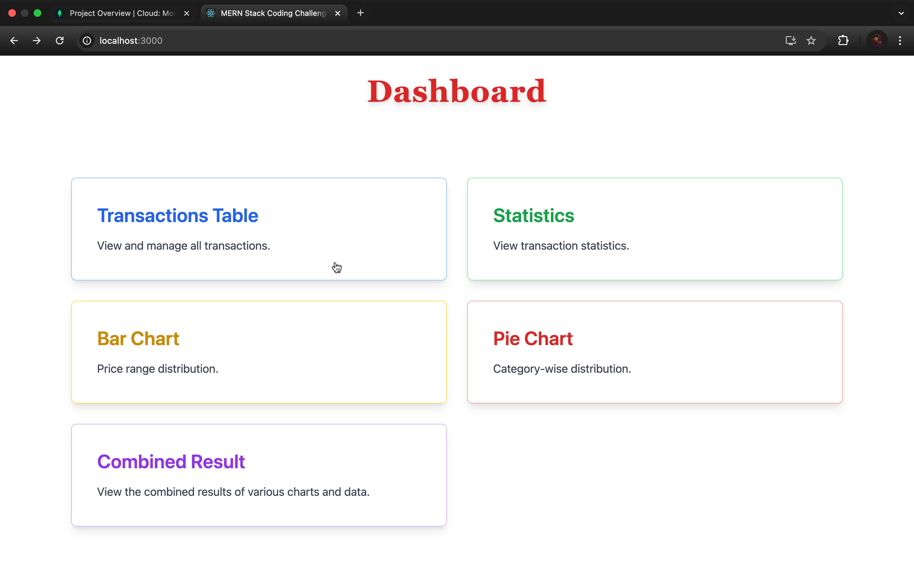
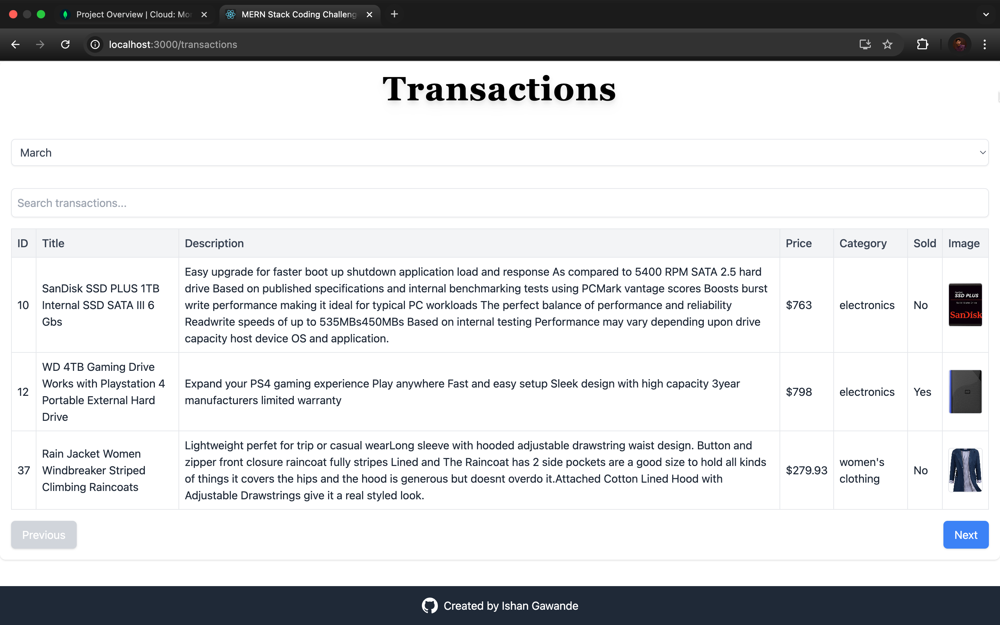

# MERN Stack Coding Challenge

This is a full-stack MERN application designed to manage product transaction data, display statistics, and visualize the data using charts. The backend is built with Node.js, Express, and MongoDB, while the frontend is developed with React. The application allows users to view product transactions, search and paginate through the data, view transaction statistics, and visualize the data using bar and pie charts.

# Features
	•	Initialize Database: Fetch product data from a third-party API and seed it into MongoDB.
	•	Transaction Listing: View all transactions for a selected month with search and pagination functionality.
	•	Statistics: View the total sale amount, total sold items, and total unsold items for the selected month.
	•	Bar Chart: Visualize the price ranges and the number of items within each price range for the selected month.
	•	Pie Chart: Display the distribution of items by category for the selected month.
	•	Combined Data: Fetch and combine all data (transactions, statistics, bar chart, and pie chart) into a single response.

# Tech Stack
	•	Backend: Node.js, Express, MongoDB, Mongoose, Axios
	•	Frontend: React, Axios, Chart.js, react-chartjs-2
	•	Database: MongoDB
	•	Tools: Postman (for testing APIs), Docker (optional)

# Getting Started

Prerequisites
	•	Node.js (v14 or later)
	•	MongoDB (locally or MongoDB Atlas)
	•	npm (Node Package Manager)

# Installation

Clone the repository:

git clone https://github.com/ishangawande55/mern-stack-assignment-Roxiler

cd mern-stack-challenge

# Backend Setup
1.	Navigate to the backend directory:

cd server

	2.	Install the required dependencies:

npm install

	3.	Set up your MongoDB connection:
	•	Make sure MongoDB is running locally or use MongoDB Atlas.
	•	Update the mongoose.connect URL in the server.js file with your MongoDB connection string.
	4.	Create a .env file in the root directory to store your MongoDB connection string and any other sensitive data:

MONGO_URI=mongodb://localhost:27017/mern-challenge

	5.	Start the backend server:

npm run dev

The backend will be running on http://localhost:8000.

# Frontend Setup
	1.	Navigate to the frontend directory:

cd client

	2.	Install the required dependencies:

npm install

	3.	Start the frontend server:

npm run dev

The frontend will be running on http://localhost:3000.

# Screenshots
	1.	Transaction Listing: View all transactions for a selected month with search and pagination.

	2.	Statistics: View total sale amount, sold items, and unsold items for the selected month.

	3.	Bar Chart Visualization: Display price ranges and item counts for the selected month.

	4.	Pie Chart Visualization: Display item distribution by category for the selected month.

	5.	Combined Data View: View combined data of transactions, statistics, bar chart, and pie chart.

	6.	Frontend Dashboard: Overall view of the application dashboard with charts and statistics.

# Screenshots of the challenge

